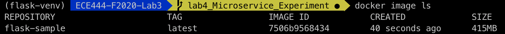
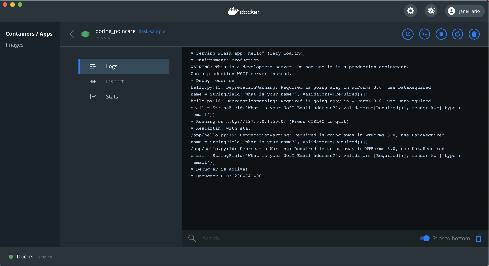
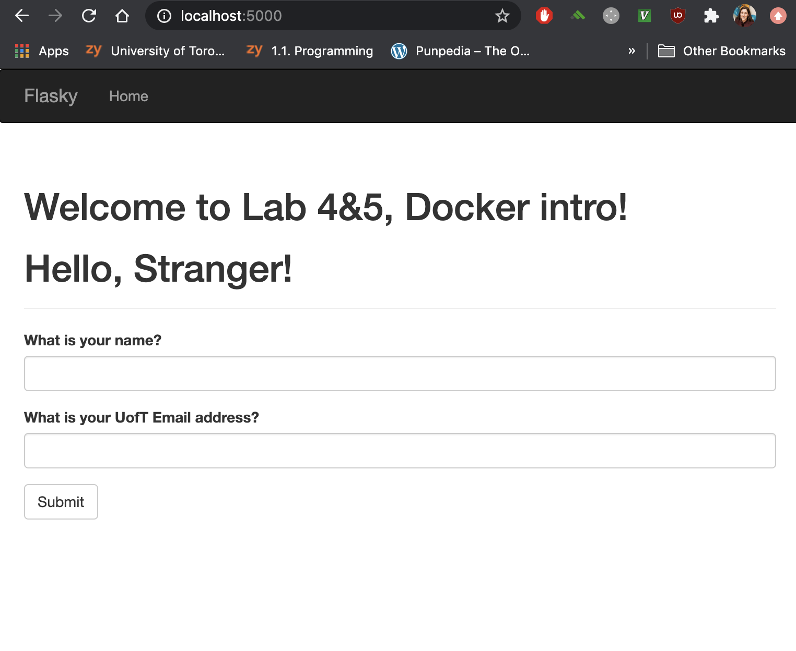

# ECE444-F2020-Lab3
Jane Illarionova Lab 3

## How to build and start the system with Docker

Step 1. Install docker on your machine and follow the set up instructions provided: https://docs.docker.com/get-started/

(the following steps use this blog for reference: https://codefresh.io/docker-tutorial/hello-whale-getting-started-docker-flask/)
Step 2. Navigate to the root directory of your flask app, and create a Dockerfile with the respective instructions for your container. This would include steps like copying dependencies from the project's "requirement.txt" file. 

Step 3. Build the docker image (run command in the same directory as the Dockerfile) by running the following command: "docker build -t <image_name>:latest ." where <image_name> is whatever you would like to name your docker image. To verify the docker image has been created run: "docker image ls". This will display a list of all docker images.

Step 4. Run the container associated with the image you built by running: "docker run -dp 5000:5000 <image_name>". This will output the contianer number. You can verify that the docker container is running with the "docker ps -a" command, which will output container run history.

You can use the docker app to see logs of your application. Find the container name, select, and you can see command line logging from the run:

Step 5. Navigate to the address output in the logs (localhost:5000) to see the application running:

An alternative way to run the dockerized flask app is using docker compose, which include adding a docker-compose.yml file to the flask app directory and running "docker-compose up". Having the docker-compose.yml allows you to build and run the app using only the "docker-compose up" command.

## Docker vs Virtual Machines
A docker containerizes an application by creating a Docker Image that represents the application's file system. Docker runs natively on Linux, and shares the kernel of the host machine with other containers. It is lightweight, occupying no more space than a regualr exectuable, and runs a discrete process.

Contrarily, a Virtual Machine uses more memory and creates more overhead than a docker container because the way it isolates an application is by running a "guest" operating system; this OS has virtual access to host resources through a hypervisor.
