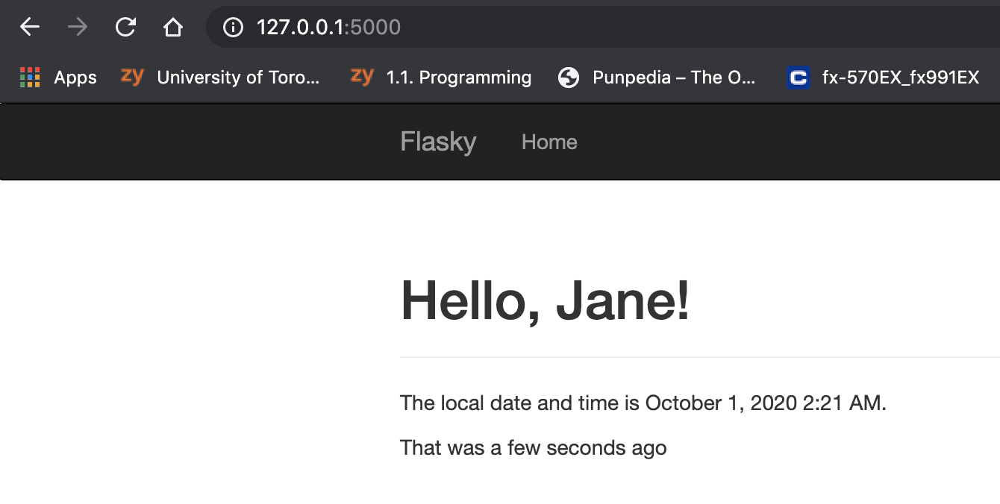

# ECE444-F2020-Lab3
Jane Illarionova Lab 3

This repo is a clone of
https://github.com/miguelgrinberg/flasky

## Activity 1

## Activity 2

## Activity 3

SQL Databases are relational databases where information is stored in tables and identified by its primary key. SQL databases require predefined schemas, allowing for more effective computation on complex queries. They have a fixed number of columns, and variable number of rows, allowing them to scale vertically but not horizontally. In contrast, NoSQL databases are non-relational databases where information is organized in documents and collections. Schemas for NoSQL databases are dynamic, can hold unstructured data, and while are not as effective for complex queries, they are able to provide more flexibility in that documents don't need to adhere to a specific schema or structure. 
